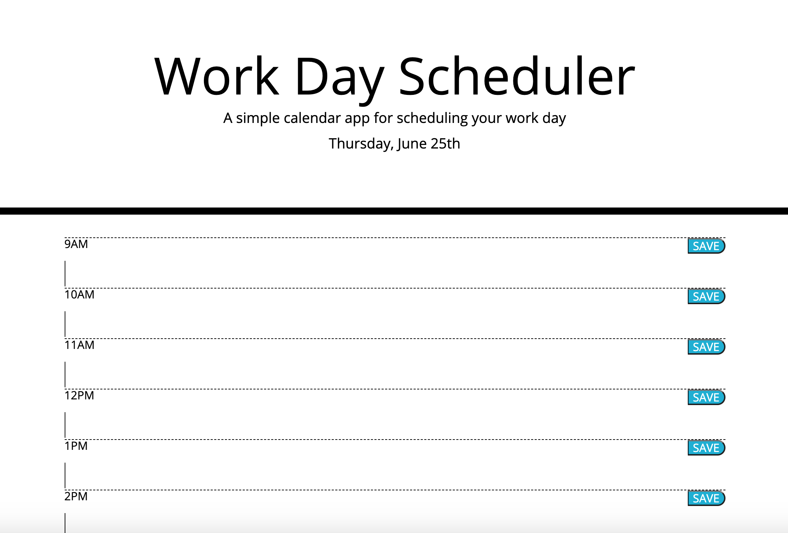

<<<<<<< HEAD
Work Day Scheduler
=======
## Third Party API's HW ##
This homework assignment consists of creating a simple work day calendar where text can be saved to the page and persist through a page refresh. The page is also meant to change the colors of each hour section depending on the time of day. I really enjoyed this assignment, and was fairly successful in putting together the html elements of the program. I was also able to make sure the current date is displayed at the top of the page. I did have an issue with causing the boxes to change colors depending on the time of day as well as logging the information to persist through a page refresh. The user is able to write text into the boxes but a page refresh will eliminate them. The boxes are not colored and do not change color based on the time of day. I put non-functioning code for the saving of data to local storage down in the bottom of the code in a note so I can work on it in the future. I had trouble getting color to appear at all outside of the buttons and I believe I need to look further into the CSS elements and how they relate to the HTML elements in order to make that happen. 

Link to deployed application: https://nmichel123.github.io/Third-Party-API-s-HW/

>>>>>>> 7d7db7e0d4f9970431d192ac9a04ecba4b889459
