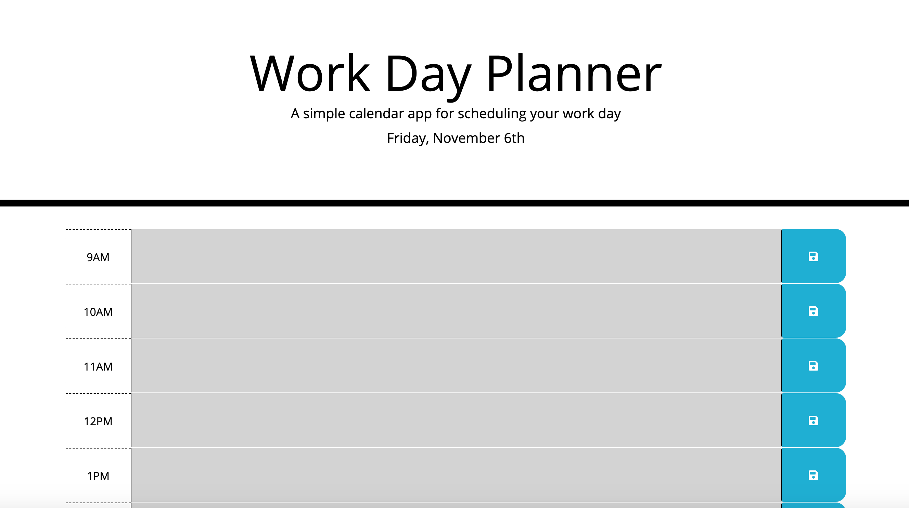

Work Day Planner

This is a work day scheduler made to keep track of hourly tasks in local storage that will persist after the page is closed or refreshed. The colors of each hour change based on the time of day to indicate if the hour is passed, current or in the future. 

Technologies used: HTML, CSS, Javascript

Link to deployed application: https://nmichel123.github.io/Work-Day-Planner/

